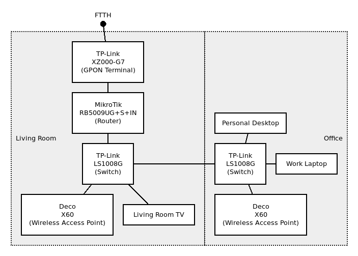

## Network diagram



## Router commands & configurations

### MikroTik RouterOS

* [Commands](./mikrotik_routeros_commands.txt)
* [Configuration](./mikrotik_routeros_configuration.txt)

### Ubiquiti EdgeOS

* [Commands](./ubiquiti_edgeos_commands.txt)
* [Configuration](./ubiquiti_edgeos_configuration.txt)
* [NTP fixer](./ntp_fixer.sh)

## NTP test script

### Resources

* [Source code](./ntp_test.py)
* [Vivo Telefônica Brasil (Brazilian ISP) output](./ntp_test_output_vivo.csv)

### Setup

```
$ sudo apt update
$ sudo apt -y install python3-pip python3-dev python3-venv
$ python3 -m venv network-toolbox-venv
$ source ./network-toolbox-venv/bin/activate
$ pip3 install dnspython scapy
```

### Run

```
$ sudo ./network-toolbox-venv/bin/python3 ./ntp_test.py
```

### Teardown

```
$ deactivate
```

## Path MTU Discovery

### IPv4

```
$ ping -c 10 -D -M do -O -s 1452 -v -4 google.com
PING  (172.217.162.206) 1452(1480) bytes of data.
[1711214721.482567] 76 bytes from gru14s20-in-f14.1e100.net (172.217.162.206): icmp_seq=1 ttl=55 (truncated)
[1711214722.462736] 76 bytes from gru14s20-in-f14.1e100.net (172.217.162.206): icmp_seq=2 ttl=55 (truncated)
[1711214723.464793] 76 bytes from gru14s20-in-f14.1e100.net (172.217.162.206): icmp_seq=3 ttl=55 (truncated)
[1711214724.466755] 76 bytes from gru14s20-in-f14.1e100.net (172.217.162.206): icmp_seq=4 ttl=55 (truncated)
[1711214725.468685] 76 bytes from gru14s20-in-f14.1e100.net (172.217.162.206): icmp_seq=5 ttl=55 (truncated)
[1711214726.470564] 76 bytes from gru14s20-in-f14.1e100.net (172.217.162.206): icmp_seq=6 ttl=55 (truncated)
[1711214727.472524] 76 bytes from gru14s20-in-f14.1e100.net (172.217.162.206): icmp_seq=7 ttl=55 (truncated)
[1711214728.474476] 76 bytes from gru14s20-in-f14.1e100.net (172.217.162.206): icmp_seq=8 ttl=55 (truncated)
[1711214729.476343] 76 bytes from gru14s20-in-f14.1e100.net (172.217.162.206): icmp_seq=9 ttl=55 (truncated)
[1711214730.478245] 76 bytes from gru14s20-in-f14.1e100.net (172.217.162.206): icmp_seq=10 ttl=55 (truncated)

---  ping statistics ---
10 packets transmitted, 10 received, 0% packet loss, time 9017ms
rtt min/avg/max/mdev = 23.357/23.472/23.594/0.069 ms
```

### IPv6

```
$ ping -c 10 -D -M do -O -s 1432 -v -6 google.com
PING google.com(2800:3f0:4001:818::200e (2800:3f0:4001:818::200e)) 1432 data bytes
[1711214752.254270] 76 bytes from 2800:3f0:4001:818::200e (2800:3f0:4001:818::200e): icmp_seq=1 ttl=55 (truncated)
[1711214753.256964] 76 bytes from 2800:3f0:4001:818::200e (2800:3f0:4001:818::200e): icmp_seq=2 ttl=55 (truncated)
[1711214754.260678] 76 bytes from 2800:3f0:4001:818::200e (2800:3f0:4001:818::200e): icmp_seq=3 ttl=55 (truncated)
[1711214755.259133] 76 bytes from 2800:3f0:4001:818::200e (2800:3f0:4001:818::200e): icmp_seq=4 ttl=55 (truncated)
[1711214756.261420] 76 bytes from 2800:3f0:4001:818::200e (2800:3f0:4001:818::200e): icmp_seq=5 ttl=55 (truncated)
[1711214757.264742] 76 bytes from 2800:3f0:4001:818::200e (2800:3f0:4001:818::200e): icmp_seq=6 ttl=55 (truncated)
[1711214758.267065] 76 bytes from 2800:3f0:4001:818::200e (2800:3f0:4001:818::200e): icmp_seq=7 ttl=55 (truncated)
[1711214759.270821] 76 bytes from 2800:3f0:4001:818::200e (2800:3f0:4001:818::200e): icmp_seq=8 ttl=55 (truncated)
[1711214760.272850] 76 bytes from 2800:3f0:4001:818::200e (2800:3f0:4001:818::200e): icmp_seq=9 ttl=55 (truncated)
[1711214761.268719] 76 bytes from 2800:3f0:4001:818::200e (2800:3f0:4001:818::200e): icmp_seq=10 ttl=55 (truncated)

--- google.com ping statistics ---
10 packets transmitted, 10 received, 0% packet loss, time 9015ms
rtt min/avg/max/mdev = 27.971/28.719/33.157/1.499 ms
```

## Traceroute

### IPv4

```
$ mtr -4 --report-wide --report-cycles 100 --show-ips --aslookup google.com
Start: 2024-03-23T14:26:28-0300
HOST: pc                                                           Loss%   Snt   Last   Avg  Best  Wrst StDev
  1. AS???    _gateway (10.175.202.1)                               0.0%   100    0.6   0.5   0.3   0.7   0.1
  2. AS18881  179.184.126.60                                        0.0%   100    2.4   2.4   2.0   3.0   0.1
  3. AS18881  191.30.9.225.dynamic.adsl.gvt.net.br (191.30.9.225)   0.0%   100    2.6   2.7   2.3   3.2   0.2
  4. AS???    ???                                                  100.0   100    0.0   0.0   0.0   0.0   0.0
  5. AS15169  72.14.194.130                                         0.0%   100   26.9  27.1  26.8  27.8   0.2
  6. AS15169  172.253.50.119                                        0.0%   100   26.6  26.7  26.4  26.9   0.1
  7. AS15169  66.249.94.31                                          0.0%   100   28.4  28.1  27.8  29.8   0.3
  8. AS15169  gru14s20-in-f14.1e100.net (172.217.162.206)           0.0%   100   23.4  23.4  22.8  24.4   0.2
```

### IPv6

```
$ mtr -6 --report-wide --report-cycles 100 --show-ips --aslookup google.com
Start: 2024-03-23T14:28:28-0300
HOST: pc                                              Loss%   Snt   Last   Avg  Best  Wrst StDev
  1. AS18881  2804:7f4:c180:c45d:72c7:90fa:ba4d:9e56   0.0%   100    0.5   0.5   0.3   0.8   0.1
  2. AS18881  2804:7f4:2000:1::bf                      0.0%   100    3.2   3.3   2.9   4.1   0.2
  3. AS18881  2804:7f4:2000:1000::8bd                 15.0%   100    3.6   3.5   3.2   4.3   0.2
  4. AS???    2001:12e0:100:3024:a002:3024:a009:2      0.0%   100    3.4   3.3   2.9   5.1   0.2
  5. AS???    2001:12e0:100:3004:a002:3024:a005:16     0.0%   100    3.1   3.4   3.1   3.9   0.1
  6. AS???    2001:12e0:100:3019:a002:3004:a002:10     4.0%   100   21.7  21.7  21.5  22.1   0.1
  7. AS???    2001:12e0:100:1016:a002:3019:a002:2     17.0%   100   26.8  26.7  26.4  27.1   0.1
  8. AS???    2001:12e0:100:1017:a001:1016:a002:2a    81.0%   100   24.1  24.4  24.1  25.1   0.2
  9. AS15169  2001:4860:1:1::d84                      20.0%   100   29.4  29.7  28.9  49.3   2.8
 10. AS15169  2800:3f0:8071::1                         0.0%   100   24.2  24.4  24.2  24.8   0.1
 11. AS15169  2001:4860:0:1::4682                     34.0%   100   25.3  25.2  24.9  25.9   0.2
 12. AS15169  2001:4860:0:1::417d                     11.0%   100   25.5  25.6  25.1  31.8   0.8
 13. AS15169  2800:3f0:4001:818::200e                  0.0%   100   27.7  27.8  26.9  28.2   0.1
```

## Speedtest CLI

https://www.speedtest.net/apps/cli

```
$ ./speedtest --selection-details

   Speedtest by Ookla

Selecting server:
      48754:  24.90 ms; BianchiNet - Jundiaí
      42154:  38.59 ms; Moovenet - Valinhos
      36605:  41.45 ms; Localnet - Guaíba
      30281:  18.67 ms; STEC-GUAIBA - Guaíba
      61847:  40.83 ms; CHTECH - Guaíba
      14143:  40.57 ms; Claro Net Vírtua - Porto Alegre
      36132:   2.55 ms; RSSul Telecom - Porto Alegre
      17678:   3.56 ms; RLNET - Porto Alegre
      38008:  40.04 ms; EdgeUno - Porto Alegre
      38068:  23.65 ms; LPInternet - Porto Alegre
      39941:  38.30 ms; Onnexx - Porto Alegre
      52447:  24.45 ms; GNS POA - Porto Alegre
      Server: RSSul Telecom - Porto Alegre (id: 36132)
         ISP: Vivo
Idle Latency:     3.76 ms   (jitter: 0.10ms, low: 3.65ms, high: 3.88ms)
    Download:   708.66 Mbps (data used: 586.5 MB)
                  9.67 ms   (jitter: 0.62ms, low: 2.98ms, high: 11.64ms)
      Upload:   356.37 Mbps (data used: 457.7 MB)
                  3.09 ms   (jitter: 11.17ms, low: 2.32ms, high: 228.79ms)
 Packet Loss:     0.0%
  Result URL: https://www.speedtest.net/result/c/eff1c292-bd15-48fd-8d6b-ed6e01fa77e5
```

## Other helpful online diagnostics

### IPv6 & DNSSEC

* https://top.nic.br/connection/

### IPv6

* https://ip6.biz/
* https://test-ipv6.com/
* https://ipv6test.google.com/
* https://ipv6-test.com/

### ICMP

* http://icmpcheck.popcount.org/

### ICMPv6

* http://icmpcheckv6.popcount.org/

### TCP MSS (IPv4 only)

* https://www.speedguide.net/analyzer.php

### Bufferbloat

* https://www.waveform.com/tools/bufferbloat

### DNS

* https://1.1.1.1/help
* https://www.dnsleaktest.com/

### Speed test

* https://beta.simet.nic.br/
* https://www.speedtest.net/
* https://fast.com/
