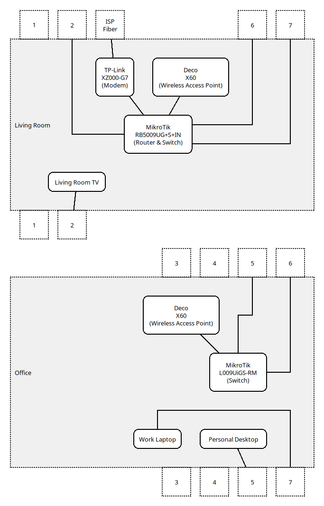

# Network toolbox

## Router commands & configurations

* [MikroTik RouterOS](./mikrotik_routeros)
* [Ubiquiti EdgeOS](./ubiquiti_edgeos)

## Automations

* [Router setup](./automations/router_setup)

## Procedures

* [Keys and certificates creation](./procedures/keys_and_certificates_creation)
* [OpenVPN client setup](./procedures/openvpn_client_setup)

## Diagnostics

* [Diagnostics](./diagnostics)
  * [Blocked ports](./diagnostics/blocked_ports)
  * [NTP servers](./diagnostics/ntp_servers)
  * [Ping analyzer](./diagnostics/ping_analyzer)

## Network diagram

