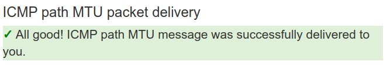
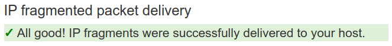

## Router commands & configurations

* [MikroTik RouterOS](./mikrotik_routeros/)
* [Ubiquiti EdgeOS](./ubiquiti_edgeos)

## Scripts

* [NTP test script](./scripts/ntp_test)
* [Ping analyzer script](./scripts/ping_analyzer/ping_analyzer.py)

## Network diagram


## Connectivity


## ICMP

### IPv4





### IPv6


## Ports blocked by the ISP

### IPv4

```
PORT      STATE         SERVICE        REASON
19/tcp    filtered      chargen        no-response
21/tcp    filtered      ftp            no-response
23/tcp    filtered      telnet         no-response
25/tcp    filtered      smtp           no-response
53/tcp    filtered      domain         no-response
80/tcp    filtered      http           no-response
81/tcp    filtered      hosts2-ns      no-response
135/tcp   filtered      msrpc          no-response
139/tcp   filtered      netbios-ssn    no-response
443/tcp   filtered      https          no-response
445/tcp   filtered      microsoft-ds   no-response
593/tcp   filtered      http-rpc-epmap no-response
1080/tcp  filtered      socks          no-response
1081/tcp  filtered      pvuniwien      no-response
3128/tcp  filtered      squid-http     no-response
4444/tcp  filtered      krb524         no-response
4480/tcp  filtered      proxy-plus     no-response
6588/tcp  filtered      analogx        no-response
7547/tcp  filtered      cwmp           no-response
8080/tcp  filtered      http-proxy     no-response
51005/tcp filtered      unknown        no-response
19/udp    open|filtered chargen        no-response
53/udp    open|filtered domain         no-response
69/udp    open|filtered tftp           no-response
81/udp    open|filtered hosts2-ns      no-response
123/udp   open|filtered ntp            no-response
135/udp   open|filtered msrpc          no-response
137/udp   open|filtered netbios-ns     no-response
138/udp   open|filtered netbios-dgm    no-response
139/udp   open|filtered netbios-ssn    no-response
319/udp   open|filtered ptp-event      no-response
320/udp   open|filtered ptp-general    no-response
443/udp   open|filtered https          no-response
1080/udp  open|filtered socks          no-response
1081/udp  open|filtered pvuniwien      no-response
3128/udp  open|filtered ndl-aas        no-response
4480/udp  open|filtered unknown        no-response
6588/udp  open|filtered unknown        no-response
8080/udp  open|filtered http-alt       no-response
```

### IPv6

```
PORT     STATE         SERVICE        REASON
21/tcp   filtered      ftp            no-response
23/tcp   filtered      telnet         no-response
25/tcp   filtered      smtp           no-response
53/tcp   filtered      domain         no-response
80/tcp   filtered      http           no-response
81/tcp   filtered      hosts2-ns      no-response
135/tcp  filtered      msrpc          no-response
139/tcp  filtered      netbios-ssn    no-response
443/tcp  filtered      https          no-response
445/tcp  filtered      microsoft-ds   no-response
593/tcp  filtered      http-rpc-epmap no-response
1080/tcp filtered      socks          no-response
1081/tcp filtered      pvuniwien      no-response
3128/tcp filtered      squid-http     no-response
4444/tcp filtered      krb524         no-response
4480/tcp filtered      proxy-plus     no-response
6588/tcp filtered      analogx        no-response
8080/tcp filtered      http-proxy     no-response
53/udp   open|filtered domain         no-response
69/udp   open|filtered tftp           no-response
81/udp   open|filtered hosts2-ns      no-response
123/udp  open|filtered ntp            no-response
135/udp  open|filtered msrpc          no-response
137/udp  open|filtered netbios-ns     no-response
138/udp  open|filtered netbios-dgm    no-response
139/udp  open|filtered netbios-ssn    no-response
319/udp  open|filtered ptp-event      no-response
320/udp  open|filtered ptp-general    no-response
443/udp  open|filtered https          no-response
1080/udp open|filtered socks          no-response
1081/udp open|filtered pvuniwien      no-response
3128/udp open|filtered ndl-aas        no-response
4480/udp open|filtered unknown        no-response
6588/udp open|filtered unknown        no-response
8080/udp open|filtered http-alt       no-response
```

## Ping

### IPv4

```
$ ping -c 1 -D -M do -O -s 1464 -4 8.8.8.8
PING 8.8.8.8 (8.8.8.8) 1464(1492) bytes of data.
[1741227643.738183] 1472 bytes from 8.8.8.8: icmp_seq=1 ttl=119 time=24.1 ms

--- 8.8.8.8 ping statistics ---
1 packets transmitted, 1 received, 0% packet loss, time 0ms
rtt min/avg/max/mdev = 24.112/24.112/24.112/0.000 ms
```

### IPv6

```
$ ping -c 1 -D -M do -O -s 1444 -6 2001:4860:4860::8888
PING 2001:4860:4860::8888(2001:4860:4860::8888) 1444 data bytes
[1741227647.074818] 1452 bytes from 2001:4860:4860::8888: icmp_seq=1 ttl=55 time=24.6 ms

--- 2001:4860:4860::8888 ping statistics ---
1 packets transmitted, 1 received, 0% packet loss, time 0ms
rtt min/avg/max/mdev = 24.567/24.567/24.567/0.000 ms
```

## Traceroute

### IPv4

```
$ mtr -4 --report-wide --report-cycles 1000 --show-ips --aslookup 8.8.8.8
Start: 2025-03-05T23:20:50-0300
HOST: pc                                                             Loss%   Snt   Last   Avg  Best  Wrst StDev
  1. AS???    _gateway (10.175.202.1)                                 0.0%  1000    0.6   0.6   0.5   0.8   0.1
  2. AS???    ???                                                    100.0  1000    0.0   0.0   0.0   0.0   0.0
  3. AS27699  201-1-227-250.dsl.telesp.net.br (201.1.227.250)         4.5%  1000    2.5   2.4   2.3  49.5   1.7
  4. AS???    152-255-210-57.user.vivozap.com.br (152.255.210.57)    48.9%  1000    2.5   2.5   2.3   3.2   0.1
  5. AS???    152-255-193-169.user.vivozap.com.br (152.255.193.169)  51.3%  1000   11.8  12.7  11.6 270.6  14.9
  6. AS???    152-255-161-170.user.vivozap.com.br (152.255.161.170)  83.1%  1000   18.6  32.1  18.4 861.4  94.6
  7. AS???    187-100-54-127.dsl.telesp.net.br (187.100.54.127)       2.0%  1000   23.6  23.3  23.1  30.8   0.4
  8. AS???    ???                                                    100.0  1000    0.0   0.0   0.0   0.0   0.0
  9. AS15169  74.125.52.64                                            0.0%  1000   19.5  19.3  19.1  20.4   0.2
 10. AS15169  209.85.143.231                                          0.0%  1000   23.5  23.4  23.2  23.8   0.1
 11. AS15169  72.14.237.57                                            0.0%  1000   24.2  24.4  24.0  42.5   0.9
 12. AS15169  dns.google (8.8.8.8)                                    0.0%  1000   24.1  23.9  23.7  24.6   0.1
```

### IPv6

```
$ mtr -6 --report-wide --report-cycles 1000 --show-ips --aslookup 2001:4860:4860::8888
Start: 2025-03-05T23:37:41-0300
HOST: pc                                              Loss%   Snt   Last   Avg  Best  Wrst StDev
  1. AS18881  2804:7f4:ca02:672f:72c7:90fa:ba4d:9e56   0.0%  1000    0.7   0.6   0.5   0.9   0.1
  2. AS???    ???                                     100.0  1000    0.0   0.0   0.0   0.0   0.0
  3. AS???    2001:12e0:500:c046:201:1:227:252         0.0%  1000    2.5   2.3   2.0   3.6   0.2
  4. AS???    2001:12e0:100:3003:a002:3004:a006:0      0.0%  1000    2.7   2.5   2.3   3.5   0.2
  5. AS???    2001:12e0:100:3003:a002:3020:a002:9      0.0%  1000   11.9  11.7  11.5  12.5   0.2
  6. AS???    2001:12e0:100:1016:a002:3020:a002:16     0.0%  1000   23.1  22.9  22.5  23.8   0.2
  7. AS???    2001:12e0:100:1016:a002:1016:a002:13     0.1%  1000   18.8  18.8  18.5  32.0   0.8
  8. AS???    2001:12e0:100:1016:a002:1016:a001:23    19.4%  1000   17.7  17.7  17.5  20.4   0.2
  9. AS15169  2001:4860:1:1::f36                       0.0%  1000   18.8  18.6  18.3  21.6   0.3
 10. AS15169  2800:3f0:8362:1c0::1                     0.0%  1000   24.2  23.9  23.7  25.1   0.1
 11. AS15169  2001:4860:0:1::2dd0                     40.3%  1000   25.1  25.3  24.6  99.9   5.1
 12. AS15169  2001:4860:0:1::24f9                      0.0%  1000   24.3  24.0  23.8  24.5   0.1
 13. AS15169  dns.google (2001:4860:4860::8888)        0.0%  1000   24.6  24.2  23.9  25.4   0.3
```

## Speedtest CLI

https://www.speedtest.net/apps/cli

```
$ ./speedtest --progress=no --selection-details

   Speedtest by Ookla

Selecting server:
      65079:  27.87 ms; SenGi Internet - São Vicente
      40803:  31.27 ms; Seguro Net - Campinas
      14143:  22.57 ms; Claro Net Vírtua - Porto Alegre
      36132:   2.37 ms; RSSul Telecom - Porto Alegre
      38008:  26.28 ms; EdgeUno - Porto Alegre
      38210:  21.32 ms; i9NET - Porto Alegre
      27206:   2.86 ms; RJ CONNECT - Porto Alegre
      54846:   2.55 ms; Amigo Internet - Porto Alegre
      69071:   2.39 ms; Velox Network Solucoes Tecnologicas - Porto Alegre
      40075:   2.08 ms; Vtal - Porto Alegre
      51576:   3.32 ms; CFG NET PROVEDOR - Porto Alegre
      13905:   8.33 ms; Melnet - Porto Alegre
      Server: Vtal - Porto Alegre (id: 40075)
         ISP: Vivo
Idle Latency:     2.52 ms   (jitter: 0.10ms, low: 2.48ms, high: 2.67ms)
    Download:   880.07 Mbps (data used: 453.4 MB)
                  2.09 ms   (jitter: 0.22ms, low: 1.65ms, high: 2.69ms)
      Upload:   511.36 Mbps (data used: 230.1 MB)
                 13.09 ms   (jitter: 6.76ms, low: 2.48ms, high: 228.32ms)
 Packet Loss:     0.0%
  Result URL: https://www.speedtest.net/result/c/8c30e3a6-83aa-41cf-9268-1eb17ec77c58
```

## Helpful online diagnostics

### IPv6 & DNSSEC

* https://top.nic.br/connection/

### IPv6

* https://ip6.biz/
* https://test-ipv6.com/
* https://ipv6test.google.com/
* https://ipv6-test.com/

### ICMP

* http://icmpcheck.popcount.org/

### ICMPv6

* http://icmpcheckv6.popcount.org/

### TCP MSS (IPv4 only)

* https://www.speedguide.net/analyzer.php

### Bufferbloat

* https://www.waveform.com/tools/bufferbloat

### DNS

* https://1.1.1.1/help
* https://www.dnsleaktest.com/


### Packet loss

* https://packetlosstest.com/

### Speed test

* https://www.speedtest.net/
* https://beta.simet.nic.br/
* https://speed.cloudflare.com/
* https://fast.com/
