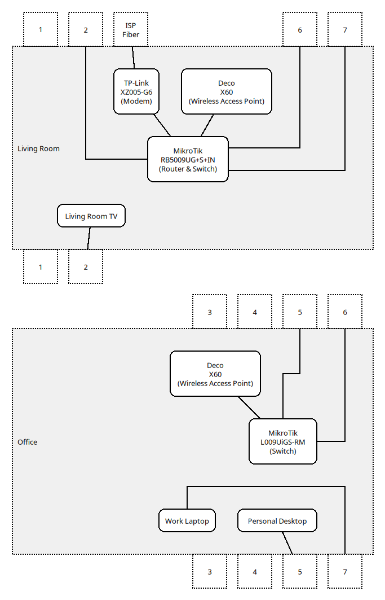

## Router commands & configurations

* [MikroTik RouterOS](./mikrotik_routeros/)
* [Ubiquiti EdgeOS](./ubiquiti_edgeos)

## Scripts

* [NTP test script](./scripts/ntp_test)

## Network diagram



## Connectivity


## ICMP

### IPv4


### IPv6


## Ping

### IPv4

```
$ ping -c 10 -D -O -4 google.com
PING  (172.217.29.142) 56(84) bytes of data.
[1728872138.804518] 64 bytes from gru10s01-in-f142.1e100.net (172.217.29.142): icmp_seq=1 ttl=55 time=25.8 ms
[1728872139.780823] 64 bytes from gru10s01-in-f14.1e100.net (172.217.29.142): icmp_seq=2 ttl=55 time=27.6 ms
[1728872140.781853] 64 bytes from gru10s01-in-f14.1e100.net (172.217.29.142): icmp_seq=3 ttl=55 time=27.8 ms
[1728872141.783531] 64 bytes from gru10s01-in-f142.1e100.net (172.217.29.142): icmp_seq=4 ttl=55 time=28.0 ms
[1728872142.785336] 64 bytes from pngrua-ad-in-f14.1e100.net (172.217.29.142): icmp_seq=5 ttl=55 time=28.1 ms
[1728872143.787132] 64 bytes from pngrua-ad-in-f14.1e100.net (172.217.29.142): icmp_seq=6 ttl=55 time=28.1 ms
[1728872144.789145] 64 bytes from gru10s01-in-f14.1e100.net (172.217.29.142): icmp_seq=7 ttl=55 time=28.2 ms
[1728872145.791079] 64 bytes from pngrua-ad-in-f14.1e100.net (172.217.29.142): icmp_seq=8 ttl=55 time=28.2 ms
[1728872146.792983] 64 bytes from pngrua-ad-in-f14.1e100.net (172.217.29.142): icmp_seq=9 ttl=55 time=28.1 ms
[1728872147.794986] 64 bytes from gru06s47-in-f14.1e100.net (172.217.29.142): icmp_seq=10 ttl=55 time=28.3 ms

---  ping statistics ---
10 packets transmitted, 10 received, 0% packet loss, time 9035ms
rtt min/avg/max/mdev = 25.777/27.802/28.255/0.702 ms
```

### IPv6

```
$ ping -c 10 -D -O -6 google.com
PING google.com(2800:3f0:4001:836::200e (2800:3f0:4001:836::200e)) 56 data bytes
[1728872149.608134] 64 bytes from 2800:3f0:4001:836::200e (2800:3f0:4001:836::200e): icmp_seq=1 ttl=55 time=21.1 ms
[1728872150.607878] 64 bytes from 2800:3f0:4001:836::200e (2800:3f0:4001:836::200e): icmp_seq=2 ttl=55 time=19.8 ms
[1728872151.608738] 64 bytes from 2800:3f0:4001:836::200e (2800:3f0:4001:836::200e): icmp_seq=3 ttl=55 time=19.7 ms
[1728872152.611641] 64 bytes from 2800:3f0:4001:836::200e (2800:3f0:4001:836::200e): icmp_seq=4 ttl=55 time=20.4 ms
[1728872153.613118] 64 bytes from 2800:3f0:4001:836::200e (2800:3f0:4001:836::200e): icmp_seq=5 ttl=55 time=20.0 ms
[1728872154.614615] 64 bytes from 2800:3f0:4001:836::200e (2800:3f0:4001:836::200e): icmp_seq=6 ttl=55 time=20.0 ms
[1728872155.616080] 64 bytes from 2800:3f0:4001:836::200e (2800:3f0:4001:836::200e): icmp_seq=7 ttl=55 time=20.0 ms
[1728872156.617248] 64 bytes from 2800:3f0:4001:836::200e (2800:3f0:4001:836::200e): icmp_seq=8 ttl=55 time=19.8 ms
[1728872157.619845] 64 bytes from 2800:3f0:4001:836::200e (2800:3f0:4001:836::200e): icmp_seq=9 ttl=55 time=20.0 ms
[1728872158.621401] 64 bytes from 2800:3f0:4001:836::200e (2800:3f0:4001:836::200e): icmp_seq=10 ttl=55 time=20.0 ms

--- google.com ping statistics ---
10 packets transmitted, 10 received, 0% packet loss, time 9014ms
rtt min/avg/max/mdev = 19.669/20.075/21.050/0.373 ms
```

## Traceroute

### IPv4

```
$ mtr -4 --report-wide --report-cycles 250 --show-ips --aslookup google.com
Start: 2024-10-13T23:16:00-0300
HOST: pc                                                             Loss%   Snt   Last   Avg  Best  Wrst StDev
  1. AS???    router.lan (10.175.202.1)                               0.0%   250    0.7   0.7   0.4   0.9   0.1
  2. AS18881  179.184.126.60                                          0.0%   250    2.6   2.4   2.1   3.7   0.2
  3. AS18881  191.30.9.229.dynamic.adsl.gvt.net.br (191.30.9.229)     0.0%   250    2.6   2.6   2.4   3.1   0.1
  4. AS???    152-255-179-142.user.vivozap.com.br (152.255.179.142)   0.0%   250    2.7   2.5   2.1   3.1   0.1
  5. AS???    152-255-183-71.user.vivozap.com.br (152.255.183.71)     0.4%   250    2.7   2.6   2.3   3.2   0.1
  6. AS???    187-100-57-205.dsl.telesp.net.br (187.100.57.205)      83.6%   250   21.4  21.5  21.4  22.1   0.1
  7. AS???    187-100-60-223.dsl.telesp.net.br (187.100.60.223)      94.4%   250   23.6  23.7  23.4  24.1   0.2
  8. AS???    187-100-57-106.dsl.telesp.net.br (187.100.57.106)      99.6%   250   28.3  28.3  28.3  28.3   0.0
  9. AS15169  74.125.52.64                                            0.0%   250   24.9  24.9  24.4  25.5   0.2
 10. AS15169  142.250.236.167                                         0.0%   250   24.8  24.6  24.4  25.3   0.1
 11. AS15169  192.178.110.169                                         0.0%   250   24.8  24.7  24.5  25.0   0.1
 12. AS15169  pngrua-ad-in-f14.1e100.net (172.217.29.142)             0.0%   250   28.0  28.1  27.8  28.5   0.1
```

### IPv6

```
$ mtr -6 --report-wide --report-cycles 250 --show-ips --aslookup google.com
Start: 2024-10-13T23:20:20-0300
HOST: pc                                              Loss%   Snt   Last   Avg  Best  Wrst StDev
  1. AS18881  2804:7f4:c183:357f:72c7:90fa:ba4d:9e56   0.0%   250    0.8   0.7   0.4   1.5   0.1
  2. AS18881  2804:7f4:2000:1::bf                      0.0%   250    3.2   3.4   2.9   4.5   0.2
  3. AS18881  2804:7f4:2000:1000::8bd                 12.4%   250    3.5   3.5   3.2   4.5   0.2
  4. AS???    2001:12e0:100:3024:a006:3024:a009:12     0.0%   250    3.4   3.3   3.0   4.2   0.2
  5. AS???    2001:12e0:100:3003:a002:3024:a006:0      0.0%   250    4.9   4.7   4.4   5.4   0.2
  6. AS???    2001:12e0:100:3003:a002:3020:a002:b      0.0%   250   14.1  14.2  13.8  15.0   0.1
  7. AS???    2001:12e0:100:1017:a002:3020:a002:2     18.0%   250   23.5  23.4  23.0  24.0   0.2
  8. AS???    2001:12e0:100:1025:a001:1017:a002:2c    76.4%   250   19.2  19.3  18.9  21.0   0.3
  9. AS15169  2001:4860:1:1::c4a                      43.2%   250   24.7  24.7  24.3  31.3   0.6
 10. AS15169  2800:3f0:8364:40::1                      0.0%   250   19.9  19.7  19.3  24.7   0.3
 11. AS15169  2001:4860:0:1::9006                     12.4%   250   25.1  25.5  24.4  61.2   2.9
 12. AS15169  2001:4860:0:1::874b                      0.0%   250   24.5  24.1  23.6  24.6   0.1
 13. AS15169  2800:3f0:4001:836::200e                  0.0%   250   19.7  19.8  19.3  20.1   0.1
```

## Speedtest CLI

https://www.speedtest.net/apps/cli

```
$ ./speedtest --progress=no --selection-details

   Speedtest by Ookla

Selecting server:
      65079:  27.64 ms; SenGi Internet - São Vicente
      48754:  27.46 ms; BianchiNet - Jundiaí
      36605:   4.58 ms; Localnet - Guaíba
      30281:  35.49 ms; STEC-GUAIBA - Guaíba
      61847:  30.75 ms; CHTECH - Guaíba
      14143:  44.68 ms; Claro Net Vírtua - Porto Alegre
      36132:   3.91 ms; RSSul Telecom - Porto Alegre
      17678:   3.42 ms; RLNET - Porto Alegre
      38008:  41.20 ms; EdgeUno - Porto Alegre
      24878:   5.07 ms; RSnetPOA - Porto Alegre
      38068:  25.24 ms; LPInternet - Porto Alegre
      39941:  42.29 ms; Onnexx - Porto Alegre
      Server: RLNET - Porto Alegre (id: 17678)
         ISP: Vivo
Idle Latency:     3.73 ms   (jitter: 0.04ms, low: 3.61ms, high: 3.75ms)
    Download:   710.16 Mbps (data used: 348.3 MB)
                 11.19 ms   (jitter: 0.53ms, low: 4.08ms, high: 12.40ms)
      Upload:   356.09 Mbps (data used: 462.0 MB)
                  3.33 ms   (jitter: 19.29ms, low: 1.91ms, high: 417.98ms)
 Packet Loss:     0.0%
  Result URL: https://www.speedtest.net/result/c/c91ca7c4-03f1-48e0-8b34-86f6c0f30f95
```

## Helpful online diagnostics

### IPv6 & DNSSEC

* https://top.nic.br/connection/

### IPv6

* https://ip6.biz/
* https://test-ipv6.com/
* https://ipv6test.google.com/
* https://ipv6-test.com/

### ICMP

* http://icmpcheck.popcount.org/

### ICMPv6

* http://icmpcheckv6.popcount.org/

### TCP MSS (IPv4 only)

* https://www.speedguide.net/analyzer.php

### Bufferbloat

* https://www.waveform.com/tools/bufferbloat

### DNS

* https://1.1.1.1/help
* https://www.dnsleaktest.com/


### Packet loss

* https://packetlosstest.com/

### Speed test

* https://www.speedtest.net/
* https://beta.simet.nic.br/
* https://speed.cloudflare.com/
* https://fast.com/
