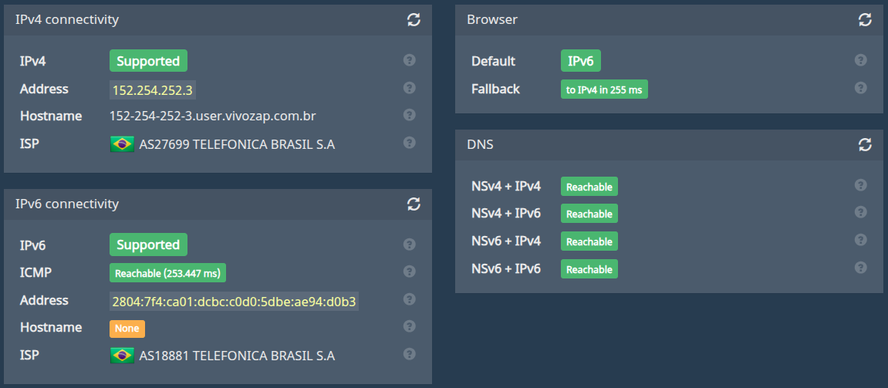
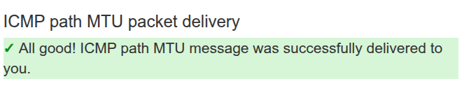
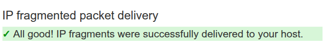

# Diagnostics

A compilation of useful diagnostic tools

---

## Scripts and commands

* [Blocked ports](./blocked_ports)
* [NTP servers](./ntp_servers)
* [Ping analyzer](./ping_analyzer)

---

## Connectivity



Test done using **[ip6.biz](https://ip6.biz/)**

---

## ICMP

### IPv4





Test done using **[icmpcheck.popcount.org](http://icmpcheck.popcount.org/)**

### IPv6


Test done using **[icmpcheckv6.popcount.org](http://icmpcheckv6.popcount.org/)**

## DNSSEC


Test done using **[wander.science/projects/dns/dnssec-resolver-test](https://wander.science/projects/dns/dnssec-resolver-test/)**

---

## Ping

### IPv4

```
$ ping -c 10 -D -M do -O -s 1464 -4 8.8.8.8
PING 8.8.8.8 (8.8.8.8) 1464(1492) bytes of data.
[1755873151.608936] 1472 bytes from 8.8.8.8: icmp_seq=1 ttl=119 time=18.0 ms
[1755873152.610279] 1472 bytes from 8.8.8.8: icmp_seq=2 ttl=119 time=18.1 ms
[1755873153.611445] 1472 bytes from 8.8.8.8: icmp_seq=3 ttl=119 time=17.9 ms
[1755873154.612757] 1472 bytes from 8.8.8.8: icmp_seq=4 ttl=119 time=18.0 ms
[1755873155.613537] 1472 bytes from 8.8.8.8: icmp_seq=5 ttl=119 time=18.1 ms
[1755873156.614982] 1472 bytes from 8.8.8.8: icmp_seq=6 ttl=119 time=18.5 ms
[1755873157.616314] 1472 bytes from 8.8.8.8: icmp_seq=7 ttl=119 time=17.9 ms
[1755873158.617409] 1472 bytes from 8.8.8.8: icmp_seq=8 ttl=119 time=17.8 ms
[1755873159.619634] 1472 bytes from 8.8.8.8: icmp_seq=9 ttl=119 time=17.9 ms
[1755873160.621100] 1472 bytes from 8.8.8.8: icmp_seq=10 ttl=119 time=18.1 ms

--- 8.8.8.8 ping statistics ---
10 packets transmitted, 10 received, 0% packet loss, time 9012ms
rtt min/avg/max/mdev = 17.824/18.017/18.476/0.172 ms
```

### IPv6

```
$ ping -c 10 -D -M do -O -s 1444 -6 2001:4860:4860::8888
PING 2001:4860:4860::8888 (2001:4860:4860::8888) 1444 data bytes
[1755873178.874827] 1452 bytes from 2001:4860:4860::8888: icmp_seq=1 ttl=250 time=28.1 ms
[1755873179.875560] 1452 bytes from 2001:4860:4860::8888: icmp_seq=2 ttl=250 time=28.1 ms
[1755873180.876609] 1452 bytes from 2001:4860:4860::8888: icmp_seq=3 ttl=250 time=28.2 ms
[1755873181.878136] 1452 bytes from 2001:4860:4860::8888: icmp_seq=4 ttl=250 time=28.2 ms
[1755873182.879742] 1452 bytes from 2001:4860:4860::8888: icmp_seq=5 ttl=250 time=28.1 ms
[1755873183.881101] 1452 bytes from 2001:4860:4860::8888: icmp_seq=6 ttl=250 time=28.0 ms
[1755873184.882482] 1452 bytes from 2001:4860:4860::8888: icmp_seq=7 ttl=250 time=28.1 ms
[1755873185.883661] 1452 bytes from 2001:4860:4860::8888: icmp_seq=8 ttl=250 time=28.2 ms
[1755873186.884461] 1452 bytes from 2001:4860:4860::8888: icmp_seq=9 ttl=250 time=28.0 ms
[1755873187.885495] 1452 bytes from 2001:4860:4860::8888: icmp_seq=10 ttl=250 time=28.1 ms

--- 2001:4860:4860::8888 ping statistics ---
10 packets transmitted, 10 received, 0% packet loss, time 9011ms
rtt min/avg/max/mdev = 28.015/28.097/28.195/0.057 ms
```

---

## Traceroute

### IPv4

```
$ mtr -4 --psize 1492 --mpls --report-wide --report-cycles 1000 --show-ips --aslookup 8.8.8.8
Start: 2025-08-22T11:52:04-0300
HOST: laptop                                                         Loss%   Snt   Last   Avg  Best  Wrst StDev
  1. AS???    _gateway (192.168.103.254)                              0.0%  1000    0.7   0.4   0.3   1.0   0.1
  2. AS???    ???                                                    100.0  1000    0.0   0.0   0.0   0.0   0.0
  3. AS27699  201-1-227-248.dsl.telesp.net.br (201.1.227.248)         0.0%  1000    3.1   3.9   2.5  22.6   3.2
  4. AS???    187-100-80-126.dsl.telesp.net.br (187.100.80.126)      71.1%  1000    2.8   3.7   2.4  88.1   8.9
  5. AS???    152-255-193-179.user.vivozap.com.br (152.255.193.179)  70.8%  1000   12.0  13.3  11.7 261.1  15.2
  6. AS???    152-255-164-244.user.vivozap.com.br (152.255.164.244)   0.2%  1000   17.3  17.4  17.0  34.4   1.2
  7. AS???    ???                                                    100.0  1000    0.0   0.0   0.0   0.0   0.0
  8. AS15169  72.14.220.222                                           1.4%  1000   23.1  19.1  17.7  24.3   2.2
  9. AS15169  142.250.238.155                                         0.0%  1000   23.1  23.0  22.9  23.8   0.2
 10. AS15169  108.170.248.7                                           0.0%  1000   24.2  24.1  23.5  72.3   2.1
 11. AS15169  dns.google (8.8.8.8)                                    0.0%  1000   22.9  19.1  17.8  23.2   2.1
```

### IPv6

```
$ mtr -6 --psize 1492 --mpls --report-wide --report-cycles 1000 --show-ips --aslookup 2001:4860:4860::8888
Start: 2025-08-22T12:09:16-0300
HOST: laptop                                          Loss%   Snt   Last   Avg  Best  Wrst StDev
  1. AS18881  2804:7f4:ca01:dcbc:6e86:3d5b:dc42:add2   0.0%  1000    0.7   0.5   0.4   1.7   0.1
  2. AS???    ???                                     100.0  1000    0.0   0.0   0.0   0.0   0.0
  3. AS???    2001:12e0:500:c046:201:1:227:252         0.0%  1000    3.0   3.6   2.6  30.9   2.8
  4. AS???    2001:12e0:100:3004:a002:3004:a006:17     0.0%  1000    2.8   2.5   2.3   3.5   0.2
  5. AS???    2001:12e0:100:3019:a002:3004:a002:e      0.0%  1000   21.9  21.6  21.4  27.3   0.3
  6. AS???    2001:12e0:100:1016:a002:3019:a002:1a     0.0%  1000   23.2  23.9  22.1  36.6   1.9
        2001:12e0:100:1016:a002:3019:a002:6
     AS???    2001:12e0:100:1016:a002:3019:a002:6
  7. AS???    2001:12e0:100:1025:a001:1016:a002:26    88.2%  1000   26.9  27.1  26.7  30.4   0.4
  8. AS15169  2800:3f0:8364:1c0::1                     0.0%  1000   27.9  26.7  22.6  29.3   1.9
  9. AS15169  2800:3f0:8364:1c0::1                     0.0%  1000   27.7  26.7  22.6  28.7   2.0
 10. AS15169  dns.google (2001:4860:4860::8888)        0.0%  1000   28.2  27.5  22.9  28.9   1.4
```

---

## Speed test

```
$ ./speedtest --progress=no --selection-details

   Speedtest by Ookla

Selecting server:
      65079:  27.02 ms; SenGi Internet - São Vicente
      40803:  21.59 ms; Seguro Net - Campinas
      14143:  24.24 ms; Claro Net Vírtua - POA - Porto Alegre
      54846:   2.35 ms; Amigo Internet - Porto Alegre
      36132:   2.34 ms; RSSul Telecom - Porto Alegre
      17678:  18.71 ms; RLNET - Porto Alegre
      27206:  13.93 ms; RJ CONNECT - Porto Alegre
      38008:  17.17 ms; EdgeUno - Porto Alegre
      52447:   3.19 ms; GNS POA - Porto Alegre
      69071:   2.75 ms; Velox Network Solucoes Tecnologicas - Porto Alegre
      40075:   2.22 ms; Vtal - Porto Alegre
       4226:  17.76 ms; Tri Telecom - Porto Alegre
      Server: Vtal - Porto Alegre (id: 40075)
         ISP: Vivo
Idle Latency:     2.59 ms   (jitter: 0.10ms, low: 2.39ms, high: 2.70ms)
    Download:   916.26 Mbps (data used: 458.9 MB)
                 16.20 ms   (jitter: 23.38ms, low: 2.55ms, high: 913.31ms)
      Upload:   511.37 Mbps (data used: 231.1 MB)
                 13.56 ms   (jitter: 7.47ms, low: 2.71ms, high: 242.65ms)
 Packet Loss:     0.0%
  Result URL: https://www.speedtest.net/result/c/d8532dc4-cbee-4fa5-aed5-38d25d15b978
```

Test done using **[Speedtest CLI](https://www.speedtest.net/apps/cli)**

---

## Extra online diagnostics

### IPv6 & DNSSEC

* https://internet.nl/
* https://top.nic.br/connection/

### IPv6

* https://test-ipv6.com/
* https://ipv6test.google.com/
* https://ipv6-test.com/

### TCP MSS (IPv4 only)

* https://www.speedguide.net/analyzer.php

### Bufferbloat

* https://www.waveform.com/tools/bufferbloat

### DNS

* https://1.1.1.1/help
* https://www.dnsleaktest.com/


### Packet loss

* https://packetlosstest.com/

### Speed test

* https://beta.simet.nic.br/
* https://speed.cloudflare.com/
* https://fast.com/
